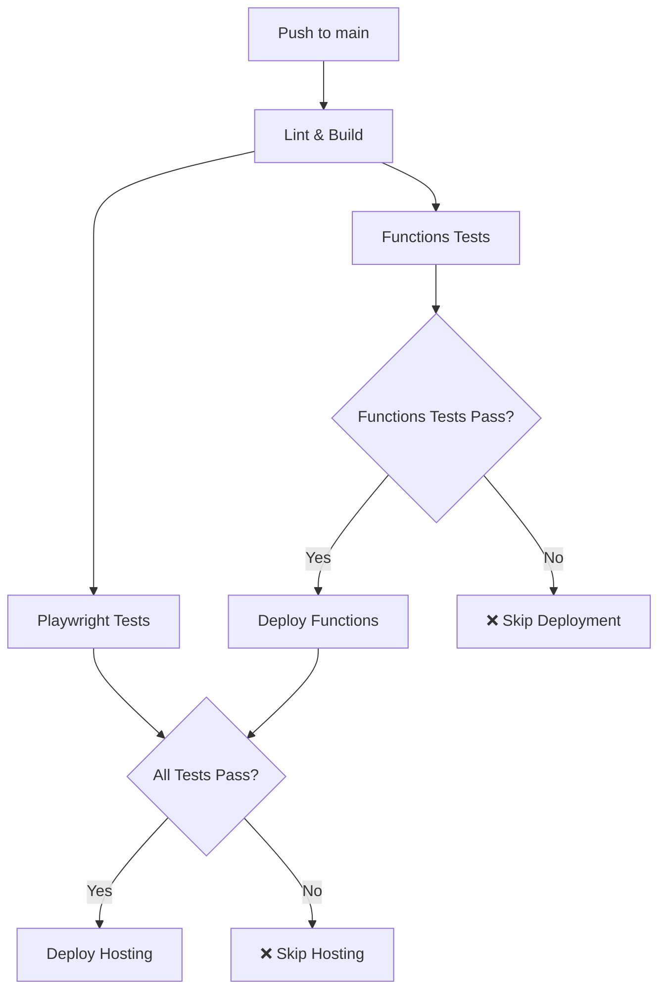

# Firebase Functions Deployment Guide

This document explains how Firebase Functions are automatically deployed when tests pass in the CI/CD pipeline.

## 🚀 Deployment Flow

### Automatic Deployment (Main Branch)
When code is pushed to the `main` branch, the following sequence occurs:

1. **Lint & Build** - Code quality checks and application build
2. **Playwright Tests** - Frontend application tests
3. **Firebase Functions Tests** - Backend functions tests
4. **Deploy Functions** - Only if Functions tests pass ✅
5. **Deploy Hosting** - Only if all tests pass ✅

### Manual Deployment
You can also trigger Functions deployment manually:

1. Go to **Actions** tab in GitHub
2. Select **"Deploy Firebase Functions"** workflow
3. Click **"Run workflow"**
4. Choose environment (staging/production)
5. Click **"Run workflow"** button

## 🔄 Workflow Dependencies



## 📋 Test Requirements

### Functions Must Pass These Tests:
- ✅ **helloWorld** - HTTP endpoint functionality
- ✅ **getUserData** - Authentication and data retrieval
- ✅ **onUserCreate** - Firestore trigger handling
- ✅ **Error Handling** - Proper error responses

### Test Failure Behavior:
- ❌ **Functions deployment is skipped**
- ❌ **Hosting deployment is skipped**
- 📊 **Test coverage is still uploaded**
- 🔍 **Detailed error logs are available**

## 🛡️ Safety Measures

### Environment Protection:
- **Production** deployments require manual approval (if configured)
- **Staging** deployments are automatic for `develop` branch
- **Functions** are deployed separately from hosting for better control

### Rollback Strategy:
- Each deployment creates a new version
- Previous versions remain available
- Can rollback via Firebase Console if needed

## 📊 Monitoring & Verification

### Deployment Verification:
- ✅ Functions list is displayed after deployment
- 📈 Deployment success notifications
- 🔗 Links to Firebase Console for monitoring

### Test Coverage:
- 📊 Coverage reports uploaded as artifacts
- 📈 Track test coverage over time
- 🔍 Identify untested code paths

## 🔧 Configuration

### Required Secrets:
- `FIREBASE_TOKEN` - Production deployment token
- `FIREBASE_TOKEN_STAGING` - Staging deployment token (optional)

### Environment Variables:
- `NODE_VERSION: '22'` - Node.js version for Functions
- `FIREBASE_CONFIG` - Firebase project configuration

## 🚨 Troubleshooting

### Common Issues:

1. **Tests Failing:**
   ```bash
   # Run tests locally to debug
   cd functions
   npm test
   ```

2. **Deployment Failing:**
   ```bash
   # Check Firebase CLI version
   firebase --version
   
   # Test deployment locally
   firebase deploy --only functions --dry-run
   ```

3. **Permission Issues:**
   - Verify `FIREBASE_TOKEN` secret is set
   - Check Firebase project permissions
   - Ensure Functions API is enabled

### Debug Commands:
```bash
# Install dependencies
npm run functions:install

# Build functions
npm run functions:build

# Run tests
npm run functions:test

# Deploy manually
npm run firebase:deploy:functions
```

## 📝 Best Practices

### Before Pushing:
1. ✅ Run tests locally: `npm run functions:test`
2. ✅ Build functions: `npm run functions:build`
3. ✅ Test functions locally: `npm run functions:serve`

### Code Quality:
- Write tests for all new functions
- Follow TypeScript best practices
- Include proper error handling
- Add comprehensive logging

### Deployment:
- Never push directly to `main` without tests
- Use feature branches for development
- Test thoroughly before merging
- Monitor deployment logs

## 🎯 Success Criteria

A successful deployment means:
- ✅ All Functions tests pass
- ✅ Functions are built successfully
- ✅ Functions are deployed to Firebase
- ✅ Functions are verified and accessible
- ✅ Hosting deployment completes (if applicable)

## 📞 Support

If you encounter issues:
1. Check the GitHub Actions logs
2. Review Firebase Console for errors
3. Verify all secrets are configured
4. Test locally before pushing
5. Contact the development team

---

**Remember:** Functions are only deployed when tests pass! 🛡️
