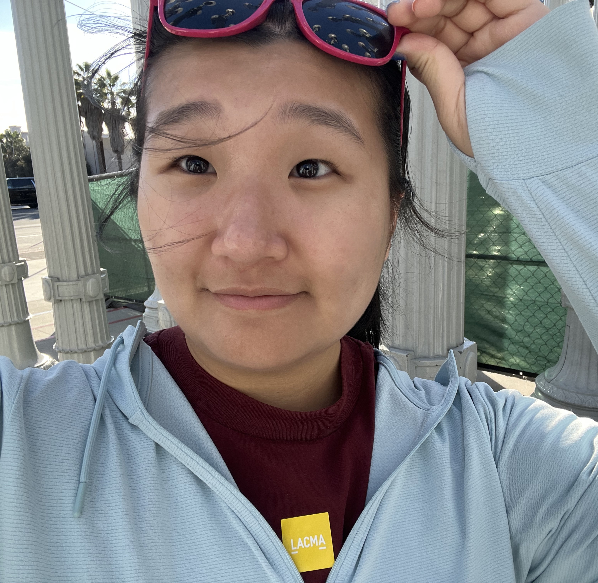

# 🏠 Journey Home

This repository contains the source code for Journey Home's donation management platform, a Next.js web application that connects furniture donors with a Connecticut nonprofit serving formerly homeless individuals. The platform features a public-facing multi-step donation form with photo uploads, an internal staff dashboard for reviewing and approving donation requests with integrated Mapbox location views, warehouse inventory management with advanced search and filtering, and role-based user access control with account approval workflows. Built with TypeScript, React 19, Tailwind CSS, and Firebase (Authentication, Firestore, Storage), the application streamlines the entire donation lifecycle from initial submission through warehouse intake and item distribution.

## 📚 Table of Contents

- [👥 Meet the Team](#-meet-the-team)

- [🛠️ Project Setup](#-project-setup)

- [🏗️ System Design](#-system-design)

- [📝 PR Instructions](#-pr-instructions)

## 👥 Meet the Team

Meet our wonderful team comprised of Product Managers, Designers, Tech Leads, Engineers, and Microsoft Mentors!

<table align="center">
  <tr>
    <td align="center" width="150">
      <a href="https://umd.hack4impact.org/">
        <br/>
        <b>Kalpana Iyer</b><br/><br/>
        
      </a>
    </td>
    <td align="center" width="150">
      <a href="https://umd.hack4impact.org/">
        <br/>
        <b>Laila Shakoor</b><br/><br/>
        
      </a>
    </td>
  </tr>
</table>

<table align="center">
  <tr>
    <td align="center" height="150" width="150">
      <a href="https://linkedin.com/in/joelchem">
        <br/>
        <b>Joel Chemmanur</b><br/><br/>
        
      </a>
    </td>
    <td align="center" height="150" width="150">
      <a href="https://umd.hack4impact.org/">
        <br/>
        <b>Aarav Verma</b><br/><br/>
        
      </a>
    </td>
  </tr>
</table>

<table align="center">
  <tr>
    <td align="center" width="150">
      <a href="https://umd.hack4impact.org/">
        <br/>
        <b>Sohayainder Kaur</b><br/><br/>
        
      </a>
    </td>
    <td align="center" width="150">
      <a href="https://umd.hack4impact.org/">
        <br/>
        <b>Tracy Tan</b><br/><br/>
        
      </a>
    </td>
    <td align="center" width="150">
      <a href="https://umd.hack4impact.org/">
        <br/>
        <b>Katie Yang</b><br/><br/>
        
      </a>
    </td>
  </tr>
</table>

<table align="center">
  <tr>
    <td align="center" width="150">
      <a href="https://umd.hack4impact.org/">
        <br/>
        <b>Anya Jain</b><br/><br/>
        
      </a>
    </td>
    <td align="center" width="150">
      <a href="https://umd.hack4impact.org/">
        <br/>
        <b>Sarayu Jilludumudi</b><br/><br/>
        
      </a>
    </td>
    <td align="center" width="150">
      <a href="https://umd.hack4impact.org/">
        <br/>
        <b>Amber Li</b><br/><br/>
        
      </a>
    </td>
  </tr>
  <tr>
    <td colspan="4" align="center">
        <table align="center">
          <tr>
            <td align="center" width="150">
                <a href="https://umd.hack4impact.org/">
                <br/>
                <b>Savya Miriyala</b><br><br>
                
                </a>
            </td>
            <td align="center" width="150">
                <a href="https://umd.hack4impact.org/">
                <br/>
                <b>Shreyas</b><br/><br/>
                
                </a>
            </td>
            <td align="center" width="150">
                <a href="https://umd.hack4impact.org/">
                <br/>
                <b>Anna</b><br/><br/>
                
                </a>
            </td>
          </tr>
        </table>
    </td>
  </tr>
  <tr>
    <td colspan="4" align="center">
      <table align="center">
        <tr>
          <td align="center" width="150">
            <a href="https://umd.hack4impact.org/">
            <br/>
            <b>Alisha Wu</b><br/><br/>
            
            </a>
          </td>
        </tr>
      </table>
    </td>
  </tr>
</table>
<table align="center">
  <tr>
    <td align="center" width="150">
        <a href="https://umd.hack4impact.org/">
        <br/>
        <b>Microsoft Mentor</b><br/><br/>
        
      </a>
    </td>
  </tr>
</table>

### 🎓 Our Team Alumni

<table align="center">
  <tr>
    <td align="center" width="150">
      <a href="https://umd.hack4impact.org/">
        <br/>
        <b>Arnav Dadarya</b><br/><br/>
        
      </a>
    </td>
    <td align="center" width="150">
      <a href="https://umd.hack4impact.org/">
        <br/>
        <b>Ritika Pokharel</b><br/><br/>
        
      </a>
    </td>
    <td align="center" width="150">
      <a href="https://umd.hack4impact.org/">
        <br/>
        <b>Tanvi Tewary</b><br/><br/>
        
      </a>
    </td>
  </tr>
  <tr>
    <td colspan="4" align="center">
      <table align="center">
        <tr>
          <td align="center" width="150">
            <a href="https://umd.hack4impact.org/">
            <br/>
            <b>Jibran</b><br/><br/>
            
            </a>
          </td>
        </tr>
      </table>
    </td>
  </tr>
</table>

---

## 🛠️ Project Setup

This section is pretty important, and messing up here could lead to a lot of issues later in the development process. If you aren't sure about any of these directions or something isn't working for you please reach out to one of the Tech Leads!

Install the following software from the links provided:
- [Git](https://git-scm.com/)
- [Node.js **v22**](https://nodejs.org/)

It is recommended that you use VSCode as your IDE. You can install it [here](https://code.visualstudio.com/) if you don't have it already. 

We recommend using the following VSCode extensions to make your development experience much easier. 
- [Prettier - Code formatter](https://marketplace.visualstudio.com/items?itemName=esbenp.prettier-vscode)
  - This is an auto-formatter for your code. It's already configured for this project so it should work off the bat
- [TailwindCSS IntelliSense](https://marketplace.visualstudio.com/items?itemName=bradlc.vscode-tailwindcss)
  - This will allow you to see auto completions when writing Tailwind classes and it makes working with Tailwind so much easier

Open your terminal in the directory you want the project folder to be in and then run `git clone` as shown below to clone the project onto your computer.
```bash
git clone https://github.com/Hack4Impact-UMD/journey-home.git
```
Then use the `cd` command to enter the project directory and then install the project dependencies.
```bash
cd journey-home
npm install
```
> ❗❗❗ **IMPORTANT**: There are some environment secrets that the project needs to run that are stored in a `.env` file. If you've been provided a `.env` file to use, just put this directly in your project directory. If not, copy the `env.example` file to `.env` and then configure the secrets in there.

For development, we will be using the Firebase emulator and some other Firebase CLI tools that are from the `firebase-tools` package. This package will be installed globally on your system so you can run the commands from anywhere.
```bash
npm install -g firebase-tools
```
Authenticate the Firebase Tools CLI with the Firebase account you associated with the Journey Home project.
```bash
firebase login
```
Congratulations! At this point your project environment is fully set up! Now we will get into how to run the project for development. 

First start the Firebase emulators. There's a convenient NPM script that starts all the emulators with some base data. This emulator has to always stay running, so keep it open when you have the web page running. Once you run the emulators, they will print some links that you can use to access the data in the emulator.
```bash
npm run emulators
```
__**Open a new terminal**__ and then start the Next.js development server.
```bash
npm run dev
```
Congratulations! You're running the project! Just click on the link in the terminal to view the development page. 

The default admin account login in the base emulator data is [admin@test.com]() with the password `password`. 


---

### 🏗️ System Design

🚧 Work in progress...

---

### 📝 PR Instructions

To start working on a feature, first create a branch off the main branch that's named `<your name>/<feature>`. 
```bash
git switch main
git checkout -b joel/donation-review
```
Implement the feature or complete the task you have been assigned. If you have any questions on design, implementation, or anything at all please ask the Tech Leads. Make sure you use types from the `types/` folder whenever appropriate. Usually you can also use existing pages as a guideline on how to implement new ones. 

When you are finished, make sure you thoroughly test your feature to make sure it works. Ensure that your code is cleanly written and formatted like the rest of the repository (just run the Prettier formatter). 

Once you're happy with it, run your changes through the linter.
```bash
npm run lint
```
If the linter doesn't find any issues, you can then ensure that your code build's properly.
```bash
npm run build
```
If the build completes without errors, your code will likely pass CI checks as well.

Stage and commit your changes with a descriptive commit message, then push to your branch.
```bash
git add <files>
git commit -m "Add donation review functionality"
git push origin joel/donation-review
```

On GitHub, create a **draft PR**. Fill out the PR template completely, including screenshots of your changes and implementation notes for reviewers. Before submitting the PR, check the "Files Changed" tab to verify only the intended changes are included. **Never** leave any unnecessary file changes in your PR! Make sure to remove them if you find any at this stage.

**CodeRabbit** will automatically run on your draft PR once it's submitted. Address any issues it identifies. If you're unsure about a recommendation, ask the Tech Leads. CodeRabbit is usually correct but occasionally suggests odd fixes.

Once you've addressed all CodeRabbit feedback, mark your PR as **Ready for Review** and request reviews from both Tech Leads on GitHub. Send a message in your Slack channel with team leadership to notify them.

Tech Leads will likely leave additional comments. Continue pushing changes to the same branch to address their feedback. After resolving their comments, request another review on GitHub and ping them again in Slack.

Once everything looks good, the Tech Leads will merge your code. Congratulations! You have contributed to the project!


