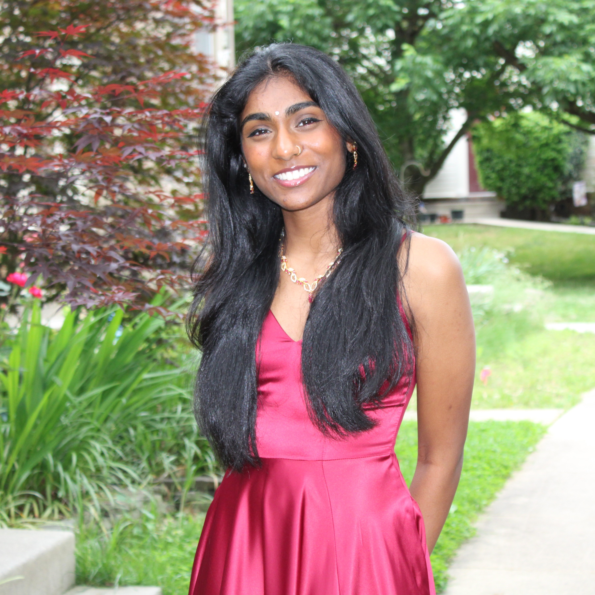
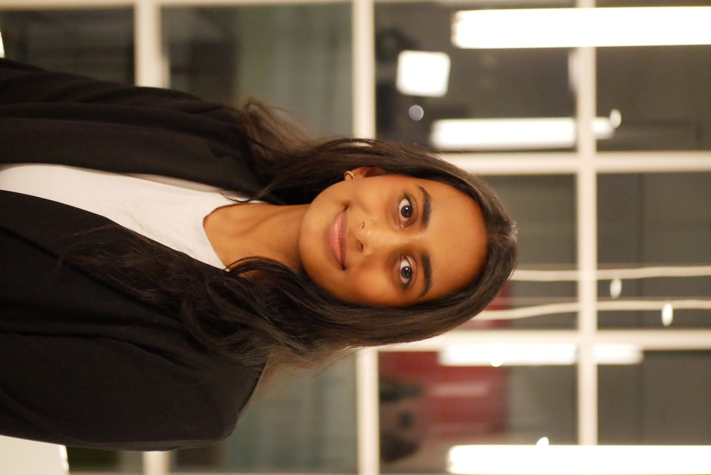

# Journey Home

### 👥 Meet the Team

Meet our wonderful team comprised of Product Managers, Designers, Tech Leads, Engineers, and Microsoft Mentors!

<table align="center">
  <tr>
    <td align="center" width="150">
      <a href="https://umd.hack4impact.org/">
        <br/>
        <b>Kalpana Iyer</b><br/><br/>
        
      </a>
    </td>
    <td align="center" width="150">
      <a href="https://umd.hack4impact.org/">
        <br/>
        <b>Laila Shakoor</b><br/><br/>
        
      </a>
    </td>
  </tr>
</table>

<table align="center">
  <tr>
    <td align="center" height="150" width="150">
      <a href="https://umd.hack4impact.org/">
        <br/>
        <b>Arnav Dadarya</b><br/><br/>
        
      </a>
    </td>
    <td align="center" height="150" width="150">
      <a href="https://linkedin.com/in/joelchem">
        <br/>
        <b>Joel Chemmanur</b><br/><br/>
        
      </a>
    </td>
  </tr>
</table>

<table align="center">
  <tr>
    <td align="center" width="150">
      <a href="https://umd.hack4impact.org/">
        <br/>
        <b>Sohayainder Kaur</b><br/><br/>
        
      </a>
    </td>
    <td align="center" width="150">
      <a href="https://umd.hack4impact.org/">
        <br/>
        <b>Tracy Tan</b><br/><br/>
        
      </a>
    </td>
    <td align="center" width="150">
      <a href="https://umd.hack4impact.org/">
        <br/>
        <b>Katie Yang</b><br/><br/>
        
      </a>
    </td>
  </tr>
</table>

<table align="center">
  <tr>
    <td align="center" width="150">
      <a href="https://umd.hack4impact.org/">
        <br/>
        <b>Anya Jain</b><br/><br/>
        
      </a>
    </td>
    <td align="center" width="150">
      <a href="https://umd.hack4impact.org/">
        <br/>
        <b>Sarayu Jilludumudi</b><br/><br/>
        
      </a>
    </td>
    <td align="center" width="150">
      <a href="https://umd.hack4impact.org/">
        <br/>
        <b>Amber Li</b><br/><br/>
        
      </a>
    </td>
  </tr>
  <tr>
    <td colspan="4" align="center">
        <table align="center">
          <tr>
            <td align="center" width="150">
                <a href="https://umd.hack4impact.org/">
                <br/>
                <b>Savya Miriyala</b><br><br>
                
                </a>
            </td>
            <td align="center" width="150">
                <a href="https://umd.hack4impact.org/">
                <br/>
                <b>Ritika Pokharel</b><br/><br/>
                
                </a>
            </td>
            <td align="center" width="150">
                <a href="https://umd.hack4impact.org/">
                <br/>
                <b>Tanvi Tewary</b><br/><br/>
                
                </a>
            </td>
          </tr>
        </table>
    </td>
  </tr>
</table>
<table align="center">
  <tr>
    <td align="center" width="150">
        <a href="https://umd.hack4impact.org/">
        <br/>
        <b>Jibran</b><br/><br/>
        
      </a>
    </td>
  </tr>
</table>

---

## Getting Started

First, run the development server:

```bash
npm run dev
# or
yarn dev
# or
pnpm dev
# or
bun dev
```

Open [http://localhost:3000](http://localhost:3000) with your browser to see the result.

You can start editing the page by modifying `app/page.tsx`. The page auto-updates as you edit the file.

This project uses [`next/font`](https://nextjs.org/docs/app/building-your-application/optimizing/fonts) to automatically optimize and load [Geist](https://vercel.com/font), a new font family for Vercel.

## Testing

This project uses Playwright for end-to-end testing. See [TESTING.md](./TESTING.md) for detailed testing information.

```bash
# Run tests
npm test

# Run tests with UI
npm run test:ui

# View test report
npm run test:report
```
